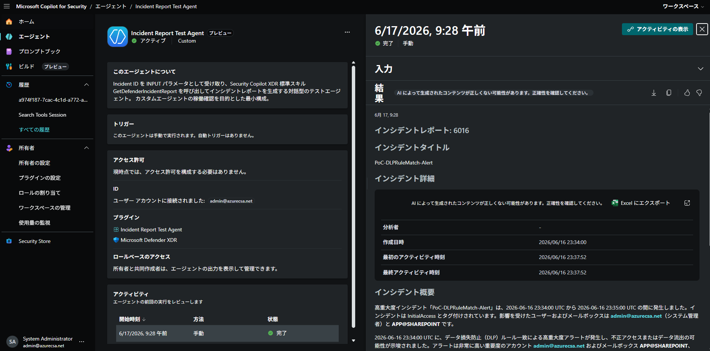

# インシデントレポート テストエージェント (IncidentReportTestAgent)

> Security Copilot のカスタムエージェントが正しく稼働するかを確認するためのシンプルなテストエージェント。INPUT パラメータに Incident ID を入力すると、Security Copilot XDR 標準スキル `GetDefenderIncidentReport`（M365 スキルセット）を呼び出してインシデントレポートを生成します。

---

## 概要

| 項目 | 内容 |
|---|---|
| プラグイン種別 | Agent（インタラクティブ / 手動トリガー） |
| モデル | gpt-4.1 |
| INPUT パラメータ | `IncidentId`（Microsoft Defender XDR インシデント ID） |
| 呼び出すスキル | XDR 標準スキル `GetDefenderIncidentReport`（M365） |
| 外部依存 | なし（カスタム KQL / Logic App / Sentinel / MDTI 不使用） |
| 出力形式 | Markdown レポート |
| 用途 | カスタムエージェントの稼働確認（動作疎通テスト） |

---

## 目的

このエージェントは、Security Copilot 環境でカスタムエージェントが
正しくアップロード・実行・スキル呼び出しできるかを確認するための
**最小構成のテストエージェント**です。

- INPUT パラメータ（`IncidentId`）が実行時に正しく入力欄として表示されるか
- エージェントが XDR 標準スキルを正しく子スキルとして呼び出せるか
- 生成結果が日本語レポートとして返るか

これらを 1 つのインシデント ID を入力するだけで確認できます。

---

## 動作ワークフロー

```
ユーザーが Incident ID を入力（実行時パラメータ）
        ↓
ステップ 1: {{IncidentId}} を取得
        ↓
ステップ 2: GetDefenderIncidentReport (M365) を呼び出し
        - Incident : {{IncidentId}}
        ↓
ステップ 3: 生成されたレポートを日本語の見出しを付けて提示
```

---

## レポート構成

標準スキル `GetDefenderIncidentReport` は、インシデント作成「後」の対応活動に
フォーカスしたレポートを生成します。

| 項目 | 内容 |
|---|---|
| 調査・修復した担当者 | 分析者 / 自動化（Automated Investigation） |
| 最初のアクティビティ時刻 | インシデントの初動時刻 |
| 実施済みアクション | 分析者・自動化が実施した調査／修復アクションとその結果 |
| 推奨フォローアップ | 未実施の推奨対応アクション一覧 |

---

## 含まれるファイル

| ファイル | 説明 |
|---------|------|
| `IncidentReportTestAgent.yaml` | Security Copilot Agent マニフェスト（YAML） |
| `IncidentReportTestAgent_card.html` | プラグインカード（ビジュアル概要） |
| `README.md` | 本ドキュメント |

---

## 前提条件

### Microsoft Security Copilot
- カスタムプラグインのアップロード権限
- 標準プラグイン **Microsoft Defender XDR（M365 スキルセット）** が有効であること

### Microsoft Defender XDR
- レポート対象が **Defender インシデント** であること（Sentinel インシデントは非対応）
- インシデントの参照権限

---

## セットアップ

### 1. プラグインのアップロード

1. [Microsoft Security Copilot](https://securitycopilot.microsoft.com) にサインインします。
2. **設定** → **カスタムプラグインの管理** → **プラグインの追加** を選択します。
3. `IncidentReportTestAgent.yaml` をアップロードします。
4. プラグインを有効化します。

### 2. 実行

1. Security Copilot の **Agents** 画面から `Incident Report Test Agent` を選択します。
2. 実行時に表示される **Incident ID** パラメータ欄に、対象の Defender インシデント ID を入力します（例: `12345`）。
3. エージェントを実行すると、インシデントレポートが日本語で生成されます。

> **Incident ID の形式**: 数値の Incident ID、または GUID 形式（`xxxxxxxx-xxxx-xxxx-xxxx-xxxxxxxxxxxx`）を指定できます。

---

## 実行結果（スクリーンショット）

Security Copilot で本エージェントを実行した結果のスクリーンショットです。

<!-- スクリーンショットを images/ フォルダに配置し、以下のパスを更新してください -->
| シーン | スクリーンショット |
|-------|-------------------|
| エージェント実行時の Incident ID 入力パラメータ |  |
| GetDefenderIncidentReport スキル呼び出し |  |
| 生成されたインシデントレポート |  |

> **Note**: `images/` フォルダにスクリーンショット画像（PNG）を配置し、上記のファイル名に合わせてください。実行後にスクリーンショットを撮影して貼り付けてください。

---

## トラブルシューティング

| 症状 | 原因 / 対処 |
|---|---|
| 実行時に Incident ID の入力欄が表示されない | `AgentDefinitions[].Settings` に `IncidentId` が定義されているか確認（スキルの `Inputs` だけでは入力欄は出ません） |
| 「該当するインシデントレポートを生成できませんでした」 | Incident ID が正しいか、Defender インシデントか（Sentinel インシデントは非対応）を確認 |
| スキルが見つからないエラー | `RequiredSkillsets` に `M365` が含まれているか、標準プラグインが有効か確認 |

---

## 備考

本エージェントは稼働確認用のテストです。本番運用では、用途に応じて
`GetIncident`（Fusion）や独自のレポート整形ロジックを組み合わせた
専用エージェントの作成を検討してください。
